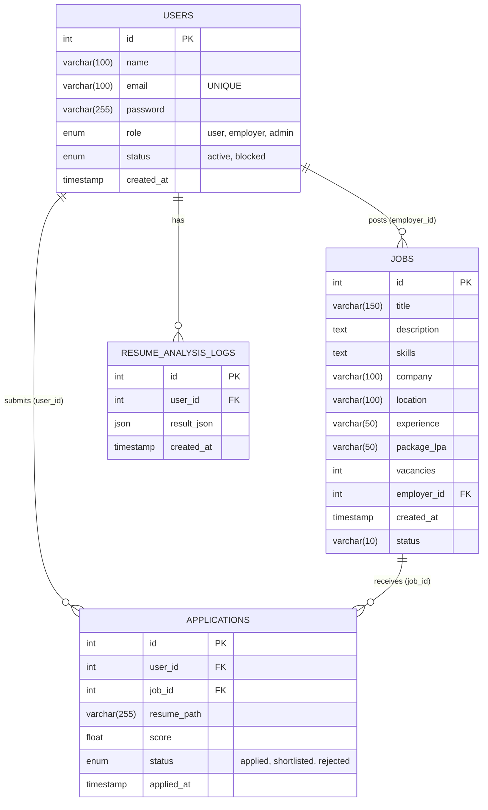
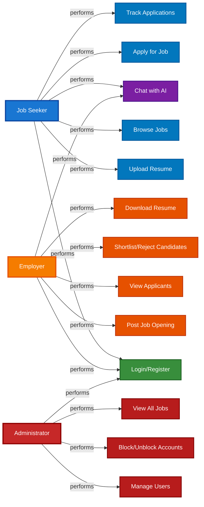
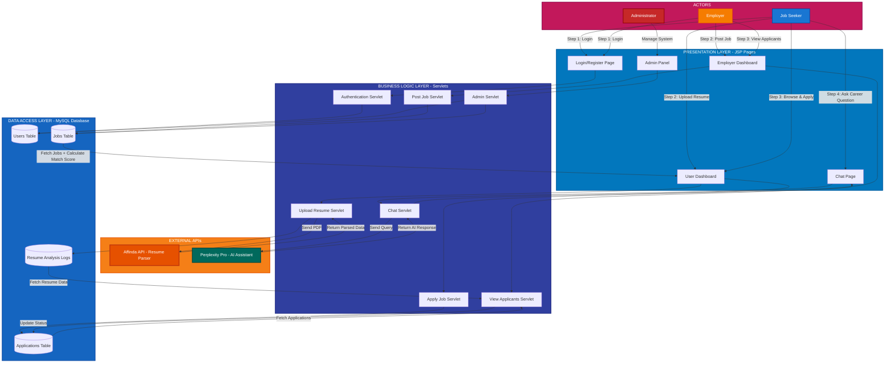
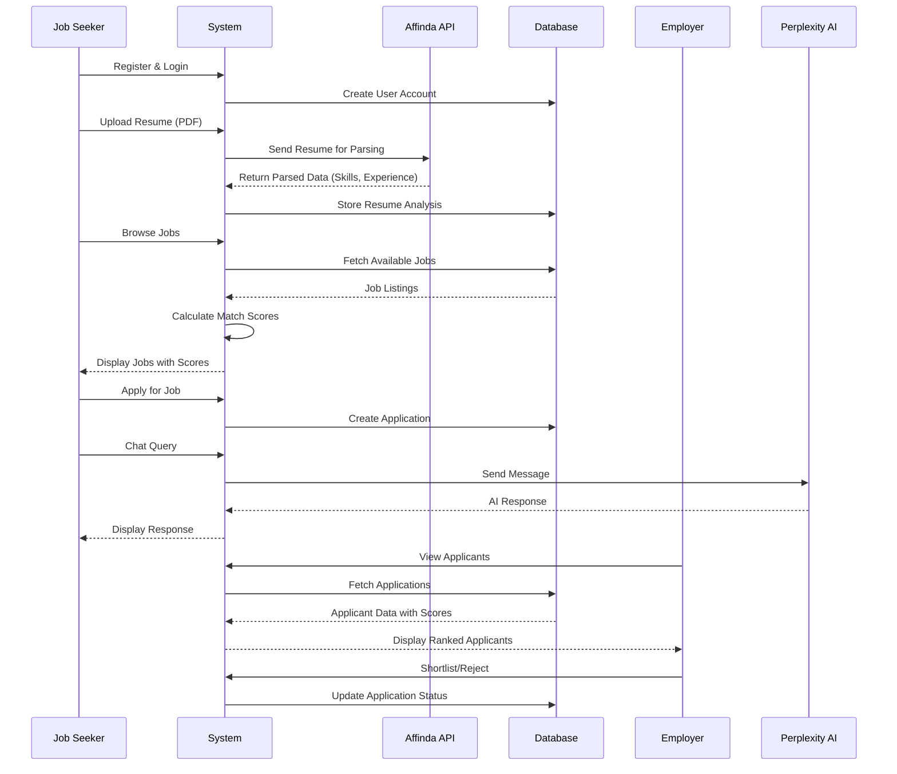

# HiroAI

[](https://www.oracle.com/java/)
[](https://www.mysql.com/)
[]()
[](https://getbootstrap.com/)

HiroAI is an intelligent recruitment platform that revolutionizes the hiring process through AI-powered resume analysis and smart candidate matching. The platform connects job seekers with employers while automating tedious recruitment tasks through advanced resume parsing and skill-matching algorithms.

---

## 🎬 Demo Video

> **Click [this link](https://drive.google.com/file/d/1lxvRhKrh5DtHyWVvnw8_7Xykl3bQVrvt/view?usp=sharing) to watch the full demo video of HiroAI.**

---

## 🚀 About

HiroAI simplifies hiring by combining resume parsing, skill extraction, and intelligent matching to surface the best candidates for each role. The platform supports multi-role access (Users, Employers, Admin), automated resume analysis using the Affinda API, OTP-based email verification, session-based authentication, and a modern responsive UI.

Key highlights:
- AI-Powered Matching: Automatic resume analysis using Affinda API
- Smart Scoring: Real-time candidate-job compatibility scoring
- Multi-Role System: Separate dashboards for Users, Employers, and Admins
- Email Integration: OTP verification and notifications
- Modern UI: Responsive glassmorphism design with animations
- Secure: Session-based authentication with role management
- AI Assistance: Support of Perplexity AI for resolving user queries

---

## ✨ Features

### For Job Seekers (Users)
- Register and create professional profiles
- Upload PDF resumes for automatic parsing
- Smart job search and filtering (location, experience, package, etc.)
- View match percentage for each job
- Track application status (Applied / Shortlisted / Rejected)
- Personalized AI-based job recommendations

### For Employers
- Create detailed job listings with required skills
- View and filter applicants
- See match scores for candidates
- Download resumes
- Shortlist or reject candidates
- Dashboard analytics for posted jobs and applicants

### For Administrators
- Manage users and accounts (block/unblock)
- Search & filter users by name, email, role
- Monitor platform activity and system overview

### System Features
- Email-based registration with OTP verification
- Session handling and role-based access control
- Automated email notifications (OTP, application updates)

---

## 🧰 Tech Stack

### Backend
- Java 17
- Jakarta EE (Servlets)
- Maven
- MySQL 8.0
- JavaMail (email features)

### Frontend
- JSP (server-side templates)
- Bootstrap 5
- Bootstrap Icons, Font Awesome
- SweetAlert2
- Vanilla JavaScript (ES6+), CSS (glassmorphism)

### External APIs & Tools
- Affinda Resume Parser API — resume parsing & skill extraction
- Perplexity AI Chat API
- Eclipse (recommended IDE)
- Apache Tomcat (application server)
- Git & GitHub
- MySQL Workbench

---

## 🏛 Architecture

HiroAI follows a three-tier architecture:


```
┌─────────────────────────────────────┐
│         Presentation Layer          │
│  (JSP, CSS, JavaScript, Bootstrap)  │
└─────────────────┬───────────────────┘
                  │
                  ▼
┌─────────────────────────────────────┐
│       Business Logic Layer          │
│        (Servlets, DAOs)             │
└─────────────────┬───────────────────┘
                  │
                  ▼
┌─────────────────────────────────────┐
│         Data Access Layer           │
│             (MySQL)                 │
└─────────────────────────────────────┘
```

Package structure (top-level):
- hiroaiapp
  - controllers/         # Servlet controllers
  - services/            # Business services
  - dao/                 # Data access objects
  - pojo/                # Entity POJOs
  - utils/               # Utility classes (Affinda API, MailUtil, etc.)
  - dbutils/             # DB connection & initialization

---

## ✅ Prerequisites

- Java Development Kit (JDK) 17 or higher  
- Apache Maven 3.6+  
- MySQL Server 8.0+  
- Apache Tomcat 10.x+  
- Git (for cloning)  
- Optional: Eclipse IDE (recommended)

System requirements:
- OS: Windows 10/11, macOS, or Linux  
- RAM: 4GB minimum (8GB recommended)  
- Disk: 500MB+ free

---

## 🛠 Installation

1. Clone the repository
```bash
git clone https://github.com/PushprajSChauhan/HiroAI.git
cd HiroAI
```

2. Build the project
```bash
mvn clean install
```

3. Deploy the generated WAR to Tomcat
- Copy `target/<artifact>.war` to `$TOMCAT_HOME/webapps/`
- Start Tomcat:
  - Linux/macOS: `$TOMCAT_HOME/bin/catalina.sh run`
  - Windows: `$TOMCAT_HOME\bin\catalina.bat run`

Or run with Maven Tomcat plugin (if configured):
```bash
mvn tomcat7:run
```

Open in browser:
```
http://localhost:8080/
```

---

## ⚙️ Configuration

# Email Configuration
mail.smtp.host=smtp.gmail.com  
mail.smtp.port=587  
mail.smtp.auth=true  
mail.smtp.starttls.enable=true  
mail.username=your-email
mail.password=your-app-password

# Affinda API Configuration
api.key=YOUR_AFFINDA_API_KEY

Notes:
- For Gmail use an App Password (if using 2FA).
- Keep credentials secret — use environment variables or secrets in production.

Edit `src/main/webapp/WEB-INF/web.xml` to change app context parameters if needed.

---

## 🗄 Database Setup

1. Create a new MySQL database.  
2. Execute the project's SQL schema (see `hiresense_db.sql`) to create tables and initial structure.  
3. Update DB connection settings in your DB utility (e.g. `DBConnection` in `dbutils`).

> Note: This README contains the ER model (Mermaid) for the schema. No additional SQL commands are included here.

---

## 🧠 ER Diagram (Database Model)

The following Mermaid ER diagram represents the database schema used by HiroAI (parsed from `hiresense_db.sql`). This diagram is embedded as Mermaid code so it renders on GitHub.



### Use Case Diagram



### Data Flow Diagram



### System Workflow



---

## ▶️ Running the Application

1. Start MySQL and ensure DB and tables are created.  
2. Ensure web.xml contains correct DB and API/email credentials.  
3. Build and deploy WAR to Tomcat (see Installation).  
4. Visit `http://localhost:8080/` and register a new user.  
5. For employer functionality, register with the `employer` role.

---

## 📚 Usage Guide

### Job Seeker (User)
- Register and verify via OTP  
- Login to access dashboard  
- Upload resume (PDF) — triggers Affinda parser and log entry  
- Browse jobs, view match percentage, and apply  
- Track application status

### Employer
- Register as employer  
- Post jobs with required skills and details  
- View applicants per job, with match scores  
- Download resumes, shortlist or reject candidates

### Admin
- Login with admin credentials  
- Manage users: search, block/unblock accounts  
- View platform metrics and system activity

---

## 🔗 API Integration (Affinda)

HiroAI integrates Affinda Resume Parser API for resume parsing and skill extraction.

#### Setup

1. Sign up at [Affinda](https://www.affinda.com/)
2. Get your API key from dashboard
3. Add to AffindaAPI util class

```properties
api.key=YOUR_AFFINDA_API_KEY
```
> Note: The Affinda API offers 14 days free trial for its services with 200 free resume parsing credits. For exploring more credit based usage plans, visit their website.

#### Features Used

- Resume text extraction
- Skills identification
- Education parsing
- Work experience extraction
- Contact information extraction

#### API Endpoints Used

```
POST https://api.affinda.com/v2/resumes
```

Example conceptual response:
```json
{
  "data": {
    "name": "John Doe",
    "email": "john@example.com",
    "skills": ["Java", "Python", "SQL"],
    "education": { ... },
    "experience": { ... }
  }
}
```

---

## 🗂 Project Structure

Representative layout:
```
hiroaiapp/
│
├── src/
│   └── main/
│       ├── java/
│       │    └── hiroaiapp/
│       │        ├── controllers/
│       │        │   ├── LoginServlet.java
│       │        │   ├── RegistrationServlet.java
│       │        │   ├── VerifyOTPRegisterServlet.java
│       │        │   ├── UserDashboardServlet.java
│       │        │   ├── EmployerDashboardServlet.java
│       │        │   ├── PostJobServlet.java
│       │        │   ├── ApplyJobServlet.java
│       │        │   ├── UploadResumeServlet.java
│       │        │   ├── ViewApplicantsServlet.java
│       │        │   ├── UpdateApplicationServlet.java
│       │        │   ├── DownloadResumeServlet.java
│       │        │   ├── AdminPanelServlet.java
│       │        │   ├── UpdateUserStatusServlet.java
│       │        │   ├── ToggleJobStatusServlet.java
│       │        │   ├── LogoutServlet.java
│       │        │   ├── ViewFullDetailsServlet.java
│       │        │   ├── DeleteJobServlet.java
│       │        │   ├── ChatAssistantServlet.java
│       │        │   └── SendRegisterOTPServlet.java
│       │        ├── dao/
│       │        │   ├── UserDAO.java
│       │        │   ├── JobDAO.java
│       │        │   ├── ApplicationDAO.java
│       │        │   └── ResumeAnalysisLogDAO.java
│       │        ├── pojo/
│       │        │   ├── UserPojo.java
│       │        │   ├── JobPojo.java
│       │        │   ├── ApplicationPojo.java
│       │        │   └── ResumeAnalysisLogsPojo.java
│       │        ├── utils/
│       │        │   ├── AffindaAPI.java
│       │        │   ├── MailUtil.java
│       │        │   ├── MailConfig.java
│       │        │   ├── AIResponseFormatter.java
│       │        │   ├── MyAuthenticator.java
│       │        └── dbutils/
│       │            ├── DBConnection.java
│       │            └── AppInitializer.java
│       │
│       └── webapp/
│           ├── css/
│           │   └── styles.css
│           ├── includes/
│           │   ├── header.jsp
│           │   └── footer.jsp
│           ├── WEB-INF/
│           │   └── web.xml
│           ├── index.jsp
|           |── chat.jsp
│           ├── login.jsp
│           ├── register.jsp
│           ├── userDashboard.jsp
│           ├── employerDashboard.jsp
│           ├── adminPanel.jsp
│           ├── viewApplicants.jsp
│           └── viewFullDetails.jsp
|            
├── target/
├── pom.xml
└── README.md
```

## 🤝 Contributing

Contributions are welcome!

1. Fork the repository  
2. Create a feature branch: `git checkout -b feature/YourFeature`  
3. Commit your changes: `git commit -m "Add feature"`  
4. Push to your branch: `git push origin feature/YourFeature`  
5. Open a Pull Request

Guidelines:
- Follow Java naming conventions and best practices.  
- Add comments for complex logic.  
- Write tests where applicable.  
- Use clear, descriptive commit messages.

---

## 📬 Contact

Project Maintainer: Pushpraj Singh Chauhan

- Email: chauhanpushprajsingh003@gmail.com  
- GitHub: https://github.com/PushprajSChauhan  
- LinkedIn: https://linkedin.com/in/pschauhan2k3

Project Link: https://github.com/PushprajSChauhan/HiroAI

---

## 🙏 Acknowledgments

- Affinda — Resume parsing API  
- Perplexity AI — Chat Assistance API  
- Bootstrap — Frontend framework  
- Font Awesome — Icons  
- SweetAlert2 — Alerts UI
- Uiverse — Animations and UI

---

## 📌 Future Enhancements

- **Real Time Chat Engagement:** Communication between Employer and Job Seeker.
- **Company Review Analyzer:** Users get chance to know more about a company reviews and salary insights.
- **Personalized Learning Path Generator:** Based on user skills, recommendations can be given for developing projects, resources and roadmaps.
- **Intelligent Interview Prep Module:** Mock face-to-face interviews with AI with real-time feedback.
- **Job Recommendation Engine:** Users can be given notifications and recommendations about new job postings suitable for their skillsets.
- **Responsive UI:** Enhanced mobile and desktop experience.
- **Fine Tuning:** The Chat Assistant can be trained or directed to be focused for responding to technical domain related queries.
  
---

<div align="center">

**Made by the Pushpraj Singh Chauhan**

Star this repository if you find it helpful!

</div>
